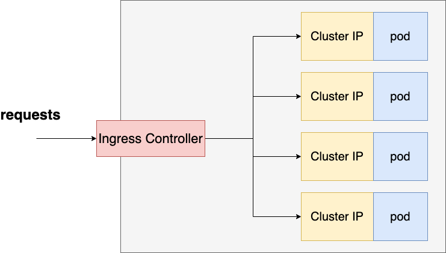

# Microservices with Kubernetes example



To start the cluster in dev using skaffold use:

```
    skaffold dev
```
## Cluster Component
- 4 backend microservices deployments with Cluster IP services to connect the services with each others.
- one react service to display the data.
- Nodeport service to access the posts microservice for dev testing purposes.
- using Ingress Nginx Controller to route the requests to all backend services.
- using skaffold to rollout and restart the deployment if any change happen in the services code or the deployment config.

